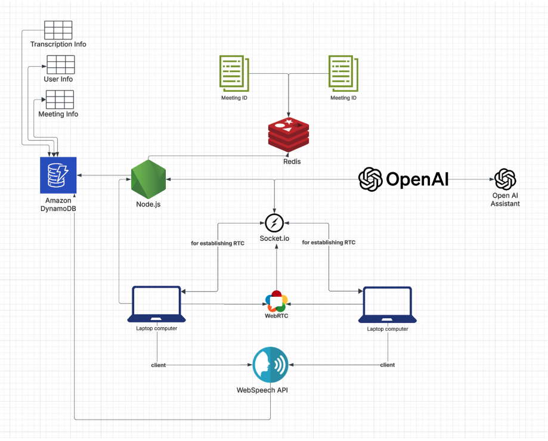
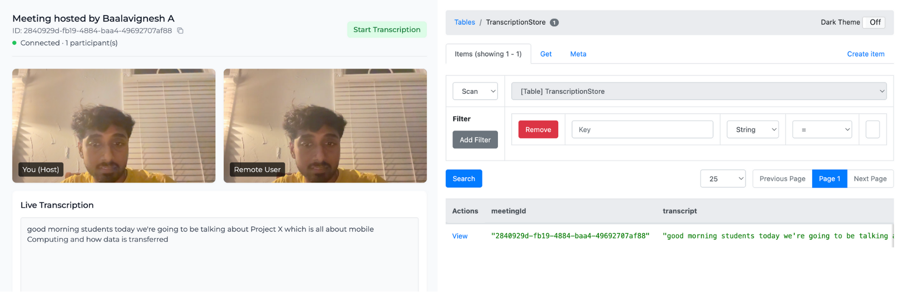
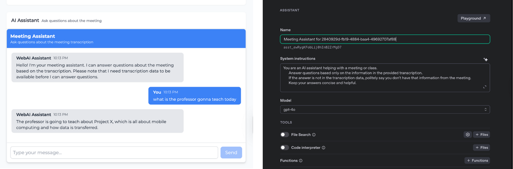

# WebAI: AI-Powered WebRTC Video Conferencing for Online Education


## Overview

WebAI is a cutting-edge video conferencing platform that enhances remote collaboration through AI-powered features. Built on WebRTC technology, it provides real-time communication with integrated speech-to-text transcription and AI-assisted conversation analysis to make meetings more productive and accessible.

## Demo

[Watch Demo Video](screenshots/demo.mp4)

## ✨ Features

- **Real-time Video Conferencing**: Connect with peers through high-quality, low-latency WebRTC connections
- **Live Transcription**: Automatic speech-to-text conversion using AWS Transcribe
- **AI Assistant**: Intelligent meeting assistant powered by OpenAI to summarize discussions and answer questions
- **Meeting History**: Store and retrieve meeting transcriptions for future reference
- **Modern UI**: Clean, responsive interface built with React and Tailwind CSS

## 🛠️ Tech Stack

### Frontend
- **React**: UI library for building the user interface
- **TypeScript**: Type-safe JavaScript
- **Tailwind CSS**: Utility-first CSS framework
- **Socket.io Client**: Real-time bidirectional communication
- **WebRTC**: Peer-to-peer audio/video communication
- **Redux Toolkit**: State management
- **Vite**: Modern frontend build tool

### Backend
- **Node.js**: JavaScript runtime
- **Express**: Web framework
- **Socket.io**: WebSocket server implementation
- **AWS Transcribe**: Speech-to-text service
- **AWS DynamoDB**: NoSQL database for meeting data
- **OpenAI API**: AI model for natural language processing
- **Redis**: In-memory data structure store for caching

## 🏗️ Architecture



The application follows a client-server architecture with peer-to-peer media streaming:

1. **Signaling Server**: Handles WebRTC signaling for establishing peer connections
2. **Media Streaming**: Direct peer-to-peer connection for audio/video transfer
3. **Transcription Pipeline**: Processes audio streams for real-time transcription
4. **AI Processing**: Analyzes conversation in real-time for insights and responses

## 📁 Project Structure

```
webai/
├── frontend/                 # React frontend application
│   ├── src/                  # Source code
│   │   ├── components/       # Reusable React components
│   │   ├── pages/            # Page components
│   │   ├── services/         # API services
│   │   ├── features/         # Redux slices
│   │   ├── store/            # Redux store configuration
│   │   ├── hooks/            # Custom React hooks
│   │   └── assets/           # Static assets
│   ├── public/               # Public assets
│   └── ...                   # Configuration files
├── backend/                  # Node.js backend server
│   ├── index.js              # Entry point
│   ├── src/                  # Source code
│   │   ├── controllers/      # Route controllers
│   │   ├── routes/           # API routes
│   │   ├── services/         # Business logic
│   │   └── models/           # Data models
│   └── ...                   # Configuration files
├── screenshots/              # Application screenshots
└── dynamodb-local/           # Local DynamoDB for development
```

### Screenshots




## 🚦 Getting Started

### Prerequisites

- Node.js (v14 or later)
- npm or yarn
- Browser that supports WebRTC and WebSpeechAPI
- DynamoDB local
- OpenAI API key

### Backend Setup

1. Navigate to the backend directory:
   ```bash
   cd backend
   ```

2. Install dependencies:
   ```bash
   npm install
   ```

3. Create a `.env` file with the following variables:
   ```
   PORT=3000
   AWS_ACCESS_KEY_ID=your_access_key
   AWS_SECRET_ACCESS_KEY=your_secret_key
   AWS_REGION=us-east-1
   OPENAI_API_KEY=your_openai_api_key
   ```

4. Start the server:
   ```bash
   npm run dev
   ```

### Frontend Setup

1. Navigate to the frontend directory:
   ```bash
   cd frontend
   ```

2. Install dependencies:
   ```bash
   npm install
   ```

3. Start the development server:
   ```bash
   npm run dev
   ```

4. Open your browser and navigate to `http://localhost:5173`

## Usage

1. **Create a Meeting**: Enter your name and click "Create New Meeting"
2. **Join a Meeting**: Enter your name and a meeting ID, then click "Join Meeting"
3. **During the Meeting**:
   - Allow camera and microphone access when prompted
   - Use the AI assistant to get insights or ask questions
   - View real-time transcription of the conversation

## AI Assistant Capabilities

The integrated AI assistant can:
- Summarize discussion points
- Answer questions based on meeting context
- Provide real-time insights
- Create action items from the conversation

## Roadmap

- [ ] Gesture detection
- [ ] Individual user context response
- [ ] End-to-end encryption
- [ ] Screen sharing capabilities
- [ ] Meeting recording and playback
- [ ] Mobile application support

## Contributors  
👤 [Baalavignesh Arunachalam](https://github.com/Baalavignesh) <br>  
👤 [Sruthi Sivasamy](https://github.com/sruthisivasamy) <br>  

## Acknowledgements

- Thanks to Professor Bo Han for the support and guidance
- Thanks to Ruizhi Cheng for the support and guidance