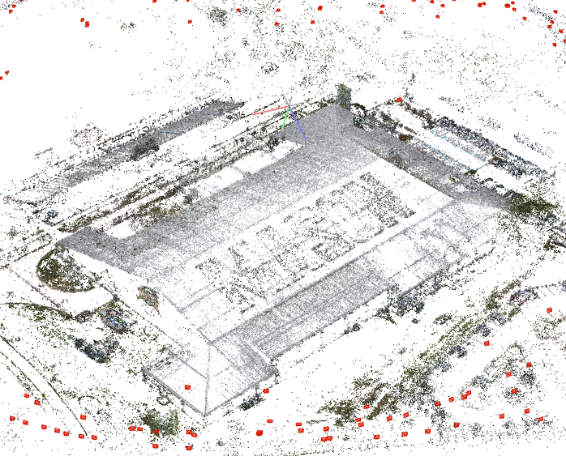
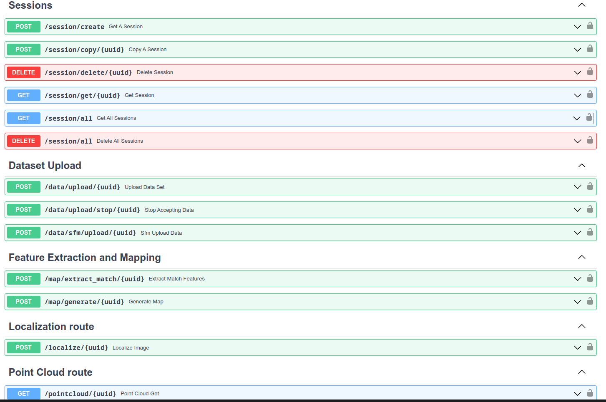

# Performance evaluation of 6DoF Localization on Mobile Devices

##  Dataset

- GMU FieldHouse
- 279 Hi-Resolution 4K Images
- Captured using DJI Mini 2 Drone
- [Link to the Dataset](https://github.com/ViswanathBalusu/CS695_REST_HLoc_Server/releases/download/v1.0.0/GMU.West.Campus.-.Field.House.zip)

## Reconstruction

- We used COLMAP Binary to build the SfM with  and 
- Config used
  - 24576 Features for Each Image.
  - `SIFT` extractor
  - `Exhautive Matching`
  - NVIDIA RTX 3080
  - Intel i9-10900KF

- [Link to the SfM Generated](https://github.com/ViswanathBalusu/CS695_REST_HLoc_Server/releases/download/v1.0.0/sfm.zip)

- Result is a point cloud with `307829` points

  

## Dense Reconstruction

- We used the same SfM and config for the dense Reconstruction
- [Link to the dense point cloud file](https://github.com/ViswanathBalusu/CS695_REST_HLoc_Server/releases/download/v1.0.0/FieldHouse.ply)
- The result is a point cloud with `42207561` points
  

- ### Video
  [](https://www.youtube.com/watch?v=whzLHJSX71c)

## Hierarchical Localization REST Server

 We built a python package on top of [Hierarchical-Localization](https://github.com/cvg/Hierarchical-Localization) package which acts as RESTful server that provide HTTP Endpoints for several things that Hierarchical-Localization do

- ### Design

  - Session based system to facilitate multiple datasets and models.
  - User Authentication using API Key.
  - A dataset that was uploaded earlier with a different config can now be reused with a different configuration.
  - The Restful API is built using FastAPI which generated a documentation page where we can test all the endpoints
  - FastAPI with Async Coroutines will boost the speed of the application to a new level.
  - Latency for each web request is included in the response header ``

- ### Package File Hierarchy

  ```
  +-- hloc_server                      # REST API Python package
      +-- helpers                      # Helper modules for Routers
          +-- __init__.py              # init module for helpers
          +-- api_key_helper.py        # API Key Handler Helper
          +-- database.py              # SQLite3 ORM Helper
          +-- point_cloud.py           # Point Cloud Helper Functions
          +-- response_models.py       # FastAPI Response Models
      +-- routers                      # Router Co-routines
          +-- __init__.py              # init which will have all the routers imported
          +-- dataset_upload.py        # Dataset, SfM Upload Co-Routines
          +-- localization_route.py    # Localization Co-Routine
          +-- map_generation_route.py  # Feature Extraction, Mapping Co-routines
          +-- point_cloud_stream.py    # Point Cloud Payload Co-Routine
          +-- session_route.py         # Session Handling Co-Routines
      +-- __init__.py                  # Variables required for the server to start
      +-- API.py                       # The module which runs the main FastAPI Router
  +-- hloc_src                         # this is where HLoc Source exist as a submodule
  ```

- ### REST API Endpoints

  

- ### Hierarchy of data that is generated while mapping

    ```
  +-- data                      
      +-- datasets                     
          +-- <Dataset UUID>             
              +-- mapping       
              +-- query
      +-- outputs                      
          +-- <Session UUID>               
              +-- sfm        
                  +-- cameras.bin   
                  +-- images.bin
                  +-- points3D.bin   
                  +-- database.db   
              +-- features.h5  
              +-- features_netvlad.h5
              +-- matches.h5  
              +-- pairs-loc.txt
              +-- pairs-sfm.txt   
  +-- sessions.sqlite                         
  ```

## Quick Start

- First Clone the repository using
  
  `git clone --recursive https://github.com/ViswanathBalusu/CS695_REST_HLoc_Server.git`
- Install HLoc Dependencies using

  ```
  cd CS695_REST_HLoc_Server/
  python3 -m venv venv
  source venv/bin/activate
  cd hloc_src && pip install -r requirements.txt
  cd .. && pip install -r requirements.txt
  ```
- Now that we have the dependencies installed, lets run the server
  - Note that this project requires ASGI Server to run. In this case we used `uvicorn`.
  
    ```
    uvicorn hloc_server.API:HLoc --reload --host 0.0.0.0 --port 8000
    ```
    
  - You can now access the Swagger Documentation page at `http://0.0.0.0:8000/docs` from where you can test the REST API.
- In order to develop more end points, anyone can just add a new modules under `routers directory` and implement a new router
- In order to access the database, one needs to import the UUID Table from `database.py` from helpers and make queries using the SQLAlchemy ORM.
- Once a router is implemented import it to the `__init__.py` of the routers module
- Import the same in `API.py` and add the handler